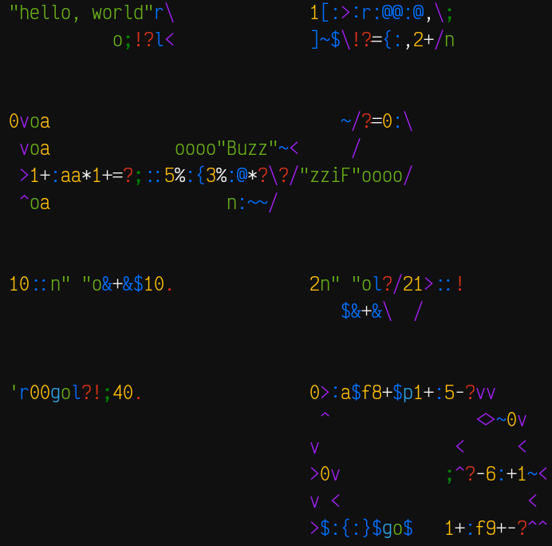
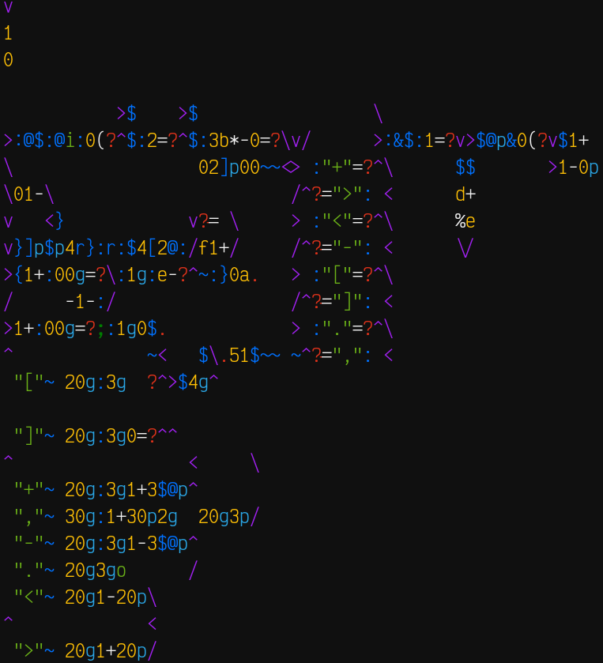

# Fish Esolang.vim

## Installation

Using [Vim Plug](https://github.com/junegunn/vim-plug), add
this to your vimrc:

```vim
call plug#begin('/path/to/your/plugins')
"your other plugins

Plug 'ethantrithon/fish-esolang.vim'

"...
call plug#end()
```

## Overview

Adds syntax highlighting for the ><> esolang.

+ Keyword color   `><^vx/\|_#` (Arrows, random, and mirrors)
+ Statement color `!?.` (Jumps)
+ Number color    `0123456789abcdef` (Hex-digits)
+ Operator color  `+-*,%()=` (All binary operators)
+ String color    `'"` (Quotes)
+ Function color  `:~$@}{rl[]&` (All stack-manipulating instructions)
+ String color    `oni` (Output char, output number, input char)
+ Special color   `gp` (Reflection instructions)
+ Question color  `;` (End execution)
+ Comment color   `EXAMPLE INVALID CODE` (Any other character)

Additionally, horizontal strings in double quotes will be highlighted as with
your string color as well (Vertical strings should therefore use single quotes
if two of them begin on the same line in order to avoid messy highlighting).

## Editing niceities

When opening a `.fsh` or `.><>` file, `virtualedit` will automatically be set to
`all` so that you can move easily across the codebox. Also, there are custom
functions which let you write (in replace mode) in the other 3 directions as
well. When using these, you should use the `<Del>` key instead of `<BS>`. I've
had some trouble remapping Backspace, but Delete has worked for me so far.
Additionally, these different writing directions are automatically used if you
type a ><> arrow in normal mode, so you can start typing in any direction
easily. Note, this will also add the arrow you pressed to your code. You may
also enter the directional writing modes via the commands `WriteUp`,
`WriteDown`, and `WriteLeft`.

## Screenshots

<details>
	<summary>Code exmaples from the esolangs wiki</summary>
	<ul>
		<li>Hello world</li>
		<li>Square root function</li>
		<li>FizzBuzz</li>
		<li>Fibonacci sequence</li>
		<li>Lucas sequence</li>
		<li>Quine (one line)</li>
		<li>Quine (2d)</li>
	</ul>
</details>



Brainf\*\*\* interpreter from the esolangs wiki

